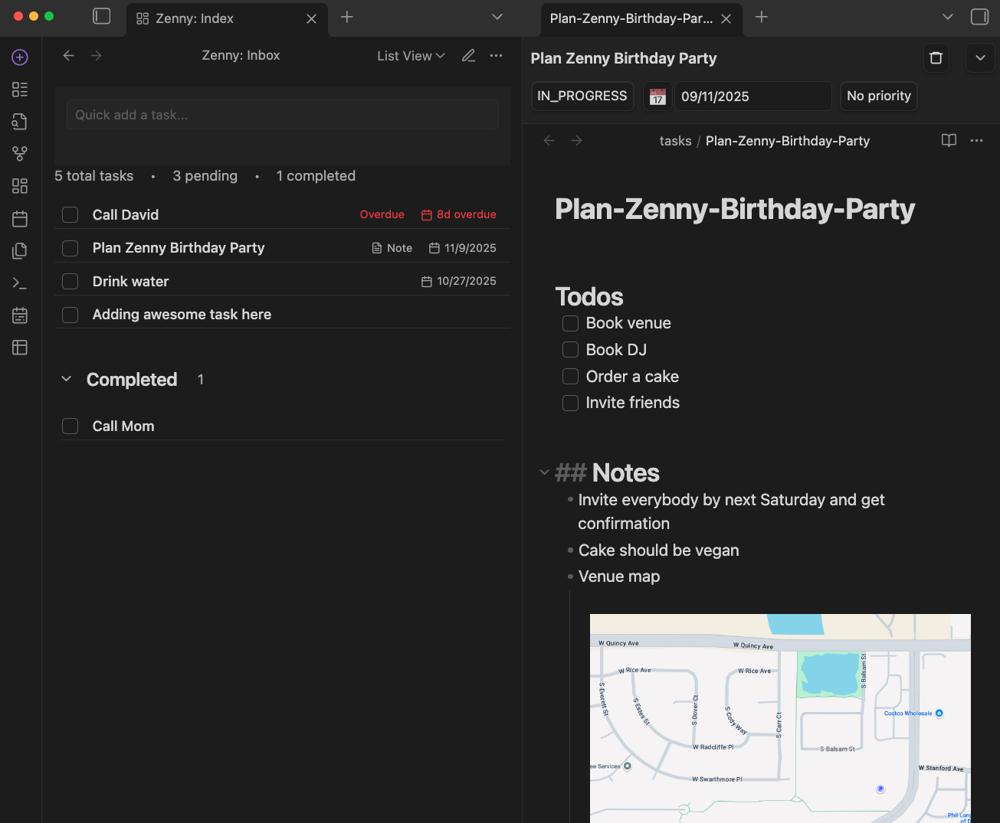
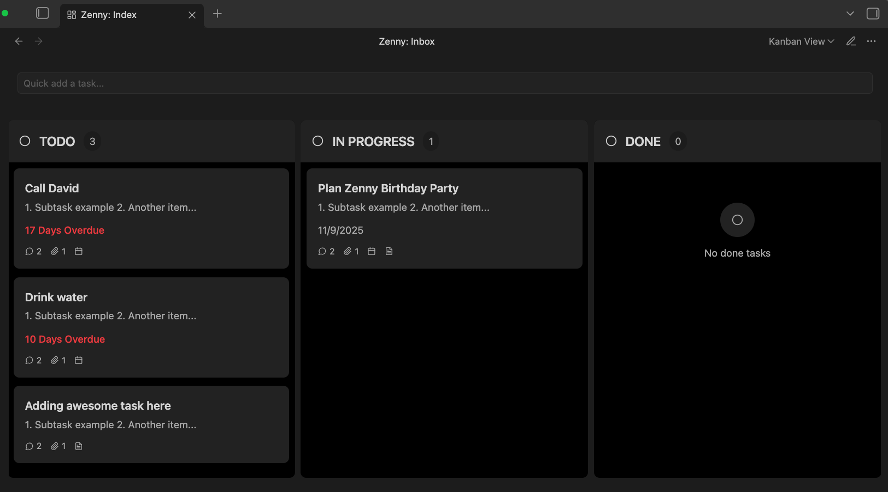
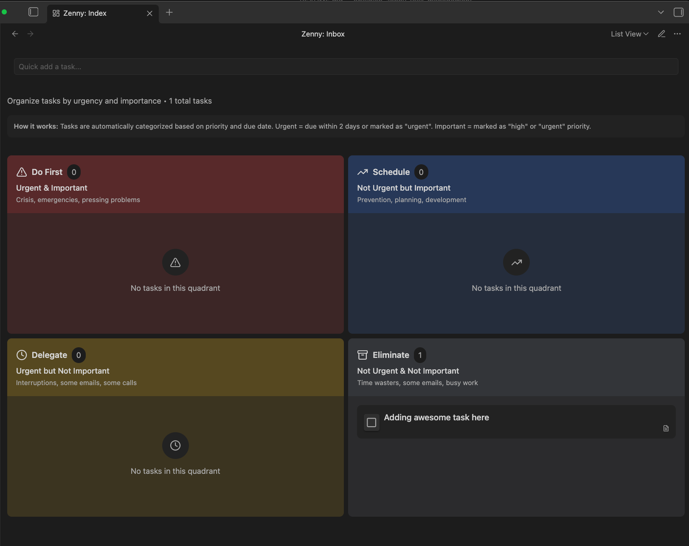
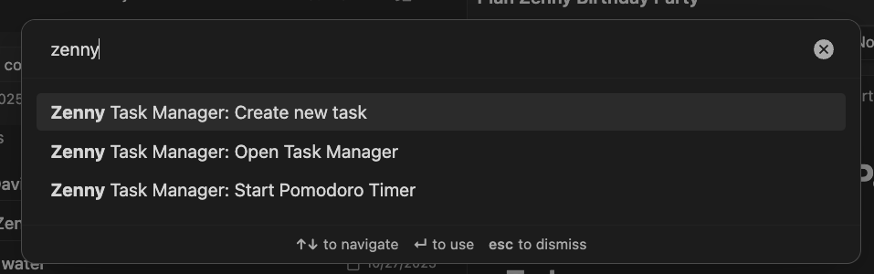

## Zenny Task Manager for Obsidian

A calm, powerful task system to help you get things done without the overwhelm. Built for modern life, fully inside your Obsidian vault.

Zenny ✅ — task management for people who want clarity, focus, and momentum.

---

### Why Zenny?

50,000 years ago, humans had three problems: find food, find shelter, and procreate. Today we juggle hundreds: stay healthy, learn skills, nurture relationships, pay bills, ship projects, plan travel, read more, meditate, walk 10k steps, track appointments, renew licenses, invest on time — the list never ends. One lifetime doesn’t feel like enough... unless your system helps you focus on what matters.

Zenny turns the chaos into clarity. Track personal, professional, and project tasks; set long/short‑term goals; run focus sessions; and generate daily/weekly/monthly summaries — all within Markdown, all in your vault.

Join the [Discord](https://discord.gg/ZESHKDr588) for updates/feature requests/issues.

---

### Screenshots (5)

1. Full View:
   

2. Natural language input:  
   

3. Kanban board for managing:
   

4. Eisenhower Matrix for planning:
   

5. Quick Commands:
   
---

### Highlights

- **Eisenhower Prioritization**: Rank by urgency and impact so the right work rises to the top.
- **Focus Sessions & Pomodoro**: Get into flow with timers and gentle breaks (coming soon).
- **Natural-Language Capture**: Type tasks the way you think; Zenny parses and files them.
- **Plans that Scale**: Yearly / Quarterly / Monthly plans for long-term direction with weekly execution.
- **Time Logging & Summaries**: See where time goes with daily/weekly/monthly rollups, so you can put your time where its needed (coming soon).
- **Mobile-ready**: Works great with Obsidian Sync; capture and review on the go (coming up).
- **Markdown-native**: Your tasks live as Markdown in your vault. No lock‑in.
- **Obsidian-first UX**: Commands, panes, and native settings.

---

### What’s inside (at a glance)

- **Task Projects** stored in a folder you choose (Markdown files, fully readable outside the plugin)
- **Quick Capture** inbox for adding tasks fast
- **Prioritization views** for Eisenhower Matrix workflows
- **Focus sessions / Pomodoro timers** with optional break suggestions, so you become *indistractable* (coming soon).
- **Flexible reports** you can share with stakeholders or keep for personal review

---

### Quick start

1. Install the plugin (see Installation below) and enable it.
2. Open the command palette and launch Zenny.
3. Set your `Default Tasks Folder` and `Default Inbox File` in Settings.
4. Capture a task using natural language (e.g., “Email Alex about Q4 deck tomorrow 9am).
5. Prioritize using urgency/impact, then start a focus session to move the needle.

Tip: Keep a daily note open for context; Zenny will keep your actual tasks tidy in your chosen folder.

---

### Installation

#### From Obsidian Community Plugins
1. Open Obsidian → Settings → Community Plugins → Browse
2. Search for “Zenny Task Manager”
3. Install → Enable

#### Manual installation
- Download the latest release from the repository
- Copy the plugin folder to `.obsidian/plugins/zenny-task-manager` in your vault
- Restart Obsidian and enable the plugin

---

### Settings

- **Default Tasks Folder**: Where Zenny stores projects/tasks (relative to vault root). Defaults to `tasks`.
- **Default Inbox File**: The Markdown file used for quick capture within your chosen folder.
- **Timers & Breaks**: Configure focus length and break suggestions to match your rhythm.
- **Views**: Choose which views/sections to show by default.

Note: All data stays in your vault. Optional integrations/sync can be enabled when available.

---

### Philosophy

Modern life is wonderfully complex — but that doesn’t mean your day should be chaotic. Zenny helps you:

- **Reduce overwhelm** by showing only what matters today
- **Make progress** on high‑impact items, not just “busy” work
- **Stay consistent** with light structure and helpful defaults

We’re also exploring a gentle “coach mode” for people who don’t enjoy planning. It will surface a few smart, high‑leverage tasks each day so you can build momentum without decision fatigue.

---

### Roadmap (selected)

- Smart daily suggestions for non-planners (fewer, high‑impact tasks)
- Richer Eisenhower and project dashboards
- More flexible reporting and exports
- Optional backend sync for team workflows

Have a request? Please open an issue or discussion.
Join the [Discord](https://discord.gg/ZESHKDr588) for updates/feature requests/issues.

---

### FAQ

- **Where are my tasks stored?** In Markdown files in your vault, inside the folder you select.
- **Does it work with native Obsidian tasks?** Yes — Zenny plays nicely with Obsidian’s task syntax and workflows.
- **Is this mobile-friendly?** Not yet, but it will be. Works with Obsidian on iOS/Android; Obsidian Sync recommended for cross‑device.
- **Lock‑in?** Nope. Your data remains plain text in your vault.

---

### Contributing

Issues, feature requests are welcome. If you’re unsure whether something fits the vision, open an issue first so we can discuss the approach.

Also, you should join our [Discord server](https://discord.gg/ZESHKDr588) for updates/feature requests/issues.

---

### Changelog

See `CHANGELOG.md`.

---

### Credits & License

Community feedback makes this better — thank you.  
This code is released under the MIT License.

